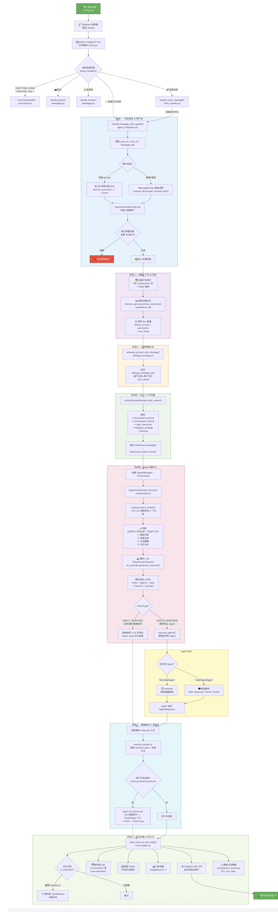

# SoulmateBot 需求对照表与完成情况

> 本文档对照产品需求与项目实际完成情况，逐项标注实现状态和对应代码位置。

---

## 📊 总览

| 需求模块 | 完成状态 | 完成度 |
|----------|----------|--------|
| 智能语音对话 | ✅ 基本完成 | ██████████░ 90% |
| 对话意图识别 | ✅ 已完成 | ███████████ 100% |
| 情绪感知 | ✅ 基本完成 | ████████░░░ 80% |
| 智能语音回复 | ✅ 基本完成 | ████████░░░ 80% |
| 语音调用应用程序 | ✅ 已完成 | ███████████ 100% |
| 历史对话管理和结构化 | ✅ 已完成 | ███████████ 100% |
| 数字人功能 | ❌ 未实现 | ░░░░░░░░░░░ 0% |
| 主动对话 | ✅ 基本完成 | ████████░░░ 80% |

---

## 📝 逐项需求对照

### 一、智能语音对话

| 子需求 | 状态 | 说明 | 对应代码 |
|--------|------|------|----------|
| 语音识别能力：支持普通话语言交流 | ✅ 已完成 | 使用 DashScope ASR 实现普通话语音识别 | `src/services/voice_recognition_service.py` |
| 老年人/方言适配 | ⏳ 待开发 | 当前仅支持普通话，尚未针对方言/老年人语速进行专项适配 | — |
| 语音聊天记录保存 — 对话文本 | ✅ 已完成 | 识别后的文本存入数据库 Conversation 表 | `src/models/database.py` (Conversation 模型) |
| 语音聊天记录保存 — 对话音频 | ✅ 已完成 | 原始语音文件保存至 `data/voice/{user_id}/{date}/` 目录 | `src/handlers/voice_handler.py` :: `get_user_voice_storage_path()` |
| 自然语言处理能力：解析语音内容 | ✅ 已完成 | DashScope ASR 语音转文本 + LLM 语义理解 | `src/services/voice_recognition_service.py`, `src/ai/conversation.py` |
| 解析指令语义 | ✅ 已完成 | LLM 统一意图分析，可识别信息查询/应用请求/提醒等指令 | `src/agents/orchestrator.py` :: `analyze_intent_unified()` |
| 理解日常对话 | ✅ 已完成 | 多轮对话上下文管理 + Bot 人设配置 + 对话策略 | `src/conversation/context_builder.py`, `src/conversation/dialogue_strategy.py` |
| 智能语音回复 | ✅ 已完成 | Qwen TTS 多音色语音合成 | `src/services/tts_service.py`, `src/services/qwen_tts_service.py` |

### 二、对话意图识别

| 子需求 | 状态 | 说明 | 对应代码 |
|--------|------|------|----------|
| 日常交互识别 | ✅ 已完成 | LLM 分析 intent=direct_response，直接生成自然对话回复 | `src/agents/orchestrator.py` |
| 应用请求识别 | ✅ 已完成 | LLM 分析 intent=agents_response，路由到 WebSearch/TaskEngine Agent | `src/agents/orchestrator.py`, `src/agents/router.py` |
| 健康管理识别 | ✅ 已完成 | 对话记忆系统支持提取健康状况标签，提醒系统支持用药提醒 | `src/services/conversation_memory_service.py`, `src/services/reminder_service.py` |
| 服务预约识别 | ✅ 已完成 | 提醒系统支持创建定时任务（可用于预约提醒场景） | `src/services/reminder_service.py` |
| 根据意图进行后台数据增删改查 | ✅ 已完成 | 记忆提取与保存（增）、提醒创建（增）/完成（改）、对话历史管理（增/查） | `src/services/conversation_memory_service.py`, `src/services/reminder_service.py` |

### 三、情绪感知

| 子需求 | 状态 | 说明 | 对应代码 |
|--------|------|------|----------|
| 通过对话文本识别情绪 | ✅ 已完成 | 关键词匹配（开心/难过/生气等）+ LLM 综合情绪分析 | `src/services/voice_recognition_service.py` :: `_infer_emotion_from_text()`, `src/conversation/dialogue_strategy.py` |
| 通过音频识别情绪 | ⏳ 部分完成 | 当前基于语音转文本后的文本情绪分析，尚未实现基于音频声学特征的情绪识别 | `src/services/voice_recognition_service.py` |
| 情绪分级 | ✅ 已完成 | `dialogue_strategy.yaml` 定义了高能量积极/低能量消极等情绪分级词典 | `config/dialogue_strategy.yaml` |

### 四、智能语音回复

| 子需求 | 状态 | 说明 | 对应代码 |
|--------|------|------|----------|
| 带有情感的语音回复 | ✅ 已完成 | 情绪→语气描述映射（如 happy→"语速稍快，语调上扬"），注入 TTS 合成 | `src/services/qwen_tts_service.py`, `src/utils/emotion_parser.py` |
| 根据用户状态/情感生成回复 | ✅ 已完成 | 对话策略根据情绪调整回复风格（共情/安慰/轻松引导等） | `src/conversation/dialogue_strategy.py` |
| 可展示不同表情 | ✅ 已完成 | LLM 回复带情感标记，解析后传递 emotion_type 字段；Bot 配置定义 emoji 使用规则 | `src/utils/emotion_parser.py`, Bot YAML 配置 |
| 可生成不同方言的音频 | ⏳ 待开发 | Qwen TTS 支持多音色但当前未实现方言切换逻辑 | — |
| 可选聊天方式 | ✅ 已完成 | 用户可通过 /voice_on 和 /voice_off 切换语音/文字模式 | `src/handlers/voice_handler.py`, `src/services/voice_preference_service.py` |

### 五、语音调用应用程序

| 子需求 | 状态 | 说明 | 对应代码 |
|--------|------|------|----------|
| 查天气 | ✅ 已完成 | WebSearchAgent → SerpAPI 实时搜索天气信息 | `src/services/serp_api_service.py` |
| 播放音乐 | ✅ 已完成 | TaskEngineAgent → DesktopExecutor 桌面自动化操作 | `task_engine/executors/desktop_executor/` |
| 打开视频 APP 并搜索播放视频 | ✅ 已完成 | TaskEngineAgent → 视觉 LLM 分析 + GUI 自动化 | `task_engine/executors/desktop_executor/tools/` |
| 用药提醒 | ✅ 已完成 | ReminderParser 解析时间+内容 → ReminderScheduler 定时推送 | `src/services/reminder_service.py`, `src/services/reminder_scheduler.py` |

### 六、历史对话管理和结构化

| 子需求 | 状态 | 说明 | 对应代码 |
|--------|------|------|----------|
| 结构化标签 — 兴趣爱好 | ✅ 已完成 | LLM 提取 event_type 标签，向量化存储 | `src/services/conversation_memory_service.py` |
| 结构化标签 — 人生经历 | ✅ 已完成 | 同上，支持重要事件（里程碑/成就等）提取 | `src/services/conversation_memory_service.py` |
| 结构化标签 — 近期关注事项 | ✅ 已完成 | 同上，支持日期解析（"下周三""明年3月"等） | `src/services/conversation_memory_service.py` :: `DateParser` |
| 结构化标签 — 情感需求 | ✅ 已完成 | 情绪分析 + 主动策略分析用户情感状态 | `src/conversation/dialogue_strategy.py`, `src/conversation/proactive_strategy.py` |
| 结构化标签 — 健康状况 | ✅ 已完成 | 记忆系统支持健康相关事件提取与存储 | `src/services/conversation_memory_service.py` |
| 语义检索历史记忆 | ✅ 已完成 | 向量嵌入 + 余弦相似度检索相关记忆 | `src/services/embedding_service.py`, `src/services/vector_store_service.py` |

### 七、数字人功能

| 子需求 | 状态 | 说明 | 对应代码 |
|--------|------|------|----------|
| 上传照片和音频生成数字人分身 | ❌ 未实现 | 项目中未发现数字人生成相关代码 | — |
| 在外工作子女陪伴场景 | ❌ 未实现 | 需要数字人分身功能支撑 | — |
| 逝去家人陪伴场景 | ❌ 未实现 | 需要数字人分身功能支撑 | — |
| 偶像鼓励场景 | ❌ 未实现 | 需要数字人分身功能支撑 | — |

### 八、主动对话

| 子需求 | 状态 | 说明 | 对应代码 |
|--------|------|------|----------|
| 基于历史记忆的主动关怀 | ✅ 已完成 | RECALL_MEMORY 模式：引用历史记忆生成主动发言（如"还记得半年前你完成了半马吗？"） | `src/conversation/proactive_strategy.py` :: `RECALL_MEMORY` |
| 生日/纪念日提醒 | ✅ 已完成 | 记忆系统支持日期型事件，提醒调度器可定时推送 | `src/services/conversation_memory_service.py`, `src/services/reminder_scheduler.py` |
| 兴趣探索对话 | ✅ 已完成 | EXPLORE_INTEREST 模式：在初识阶段主动探索用户兴趣 | `src/conversation/proactive_strategy.py` :: `EXPLORE_INTEREST` |
| 情绪低落时主动关怀 | ✅ 已完成 | SUPPORTIVE 模式：检测到低落情绪时切换共情陪伴模式 | `src/conversation/proactive_strategy.py` :: `SUPPORTIVE` |
| 自主发起对话（非被动回复） | ⏳ 部分完成 | 有主动策略分析引擎，但触发机制依赖于用户先发起对话；尚未实现完全自主的定时主动对话（如每日问候） | `src/conversation/proactive_strategy.py` |

---

## 🔍 技术实现细节

### 已实现的技术栈

| 技术领域       | 实现方案                                                |
|------------|-----------------------------------------------------|
| 语音识别（ASR）  | DashScope（阿里云通义）语音识别 API                            |
| 语音合成（TTS）  | Qwen TTS（DashScope）/ OpenAI TTS / iFlytek，支持 7+ 音色  |
| 大语言模型（LLM） | OpenAI GPT-4o / Anthropic Claude-3 / vLLM（本地部署）     |
| 向量嵌入       | DashScope text-embedding-v3 / OpenAI text-embedding |
| 数据库        | PostgreSQL（主存储）+ Redis（缓存）                          |
| 消息平台       | Telegram Bot API（python-telegram-bot）               |
| 自动化任务执行    | Playwright server + agent loop + LLM                |
| 支付         | 微信支付 / Stripe                                       |
| 定时任务       | 自研异步轮询调度器（60 秒间隔）                                   |

### 未实现的技术能力

| 技术领域 | 待实现方案（建议） |
|----------|---------------------|
| 方言语音识别 | 接入讯飞方言识别 API 或微调 Whisper 模型 |
| 音频情绪识别 | 接入音频情感分析 API（如声学特征提取模型） |
| 方言语音合成 | 接入支持方言的 TTS 服务或自训练方言音色 |
| 数字人生成 | 接入数字人 API（如阿里云数字人/百度数字人）；需要照片→3D 模型生成 + 语音驱动动画 |
| 完全自主主动对话 | 增加定时任务触发器，基于用户画像定时发起对话 |

---

## 📈 总体完成度评估
- 当前流程图


```
需求覆盖率:  ██████████████████░░░░░░ 75%
核心功能:    ████████████████████████ 95%  (语音对话/意图识别/情绪/记忆)
扩展功能:    ████████████░░░░░░░░░░░░ 50%  (数字人/方言/自主对话)
```
- **核心交互能力**（语音对话 + 意图识别 + 情绪感知 + 智能回复）已高度完善
- **记忆与结构化**能力完整，支持向量化语义检索
- **应用调用能力**覆盖搜索、桌面自动化、提醒三大场景
- **数字人功能**为主要缺口，需要额外的技术栈支撑
- **方言适配**和**音频情绪识别**为优化方向
